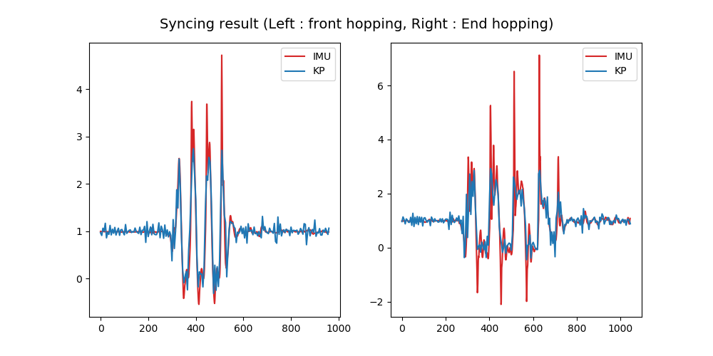

# Syncing Data

This code is to sync IMU data and 3D Keypoints data collected from CMU Panoptic Studio.
Syncing method is fully automatic, you can sync all the experiments by entering a line of code.


# Usage
Pre-step - Make sure you have MC10 IMU sensor data & Panoptic studio 3D keypoints data
```
git clone https://github.com/yohanshin/Syncing_Data.git
```
```
cd Syncing_Data
```
```
python sync_data.py --IMU-dir <IMU data path> \\
                    --KP-dir <KP data path> \\
                    --entire-exps True \\
                    --entire-parts True
```

You can only run a single experiment or just fitting with sacrum data by adjusting your argument.
If you want to generate syncing result as video file (.avi) and see the specific experiment syncing result, run
```
python sync_data.py --IMU-dir <IMU data path> \\
                    --KP-dir <KP data path> \\
                    --date <date of experiment> \\
                    --id <subject id (choose 0 or 1) \\
                    --exp <experiment number, n-th experiment by entering n> \\
                    --save-video True 
```


# Sample Result

